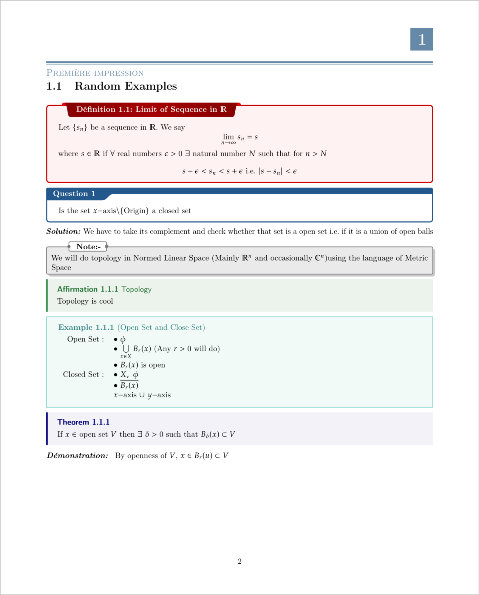
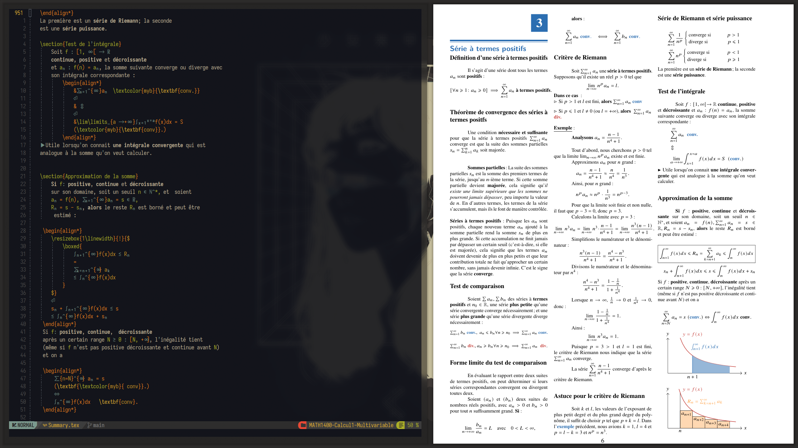
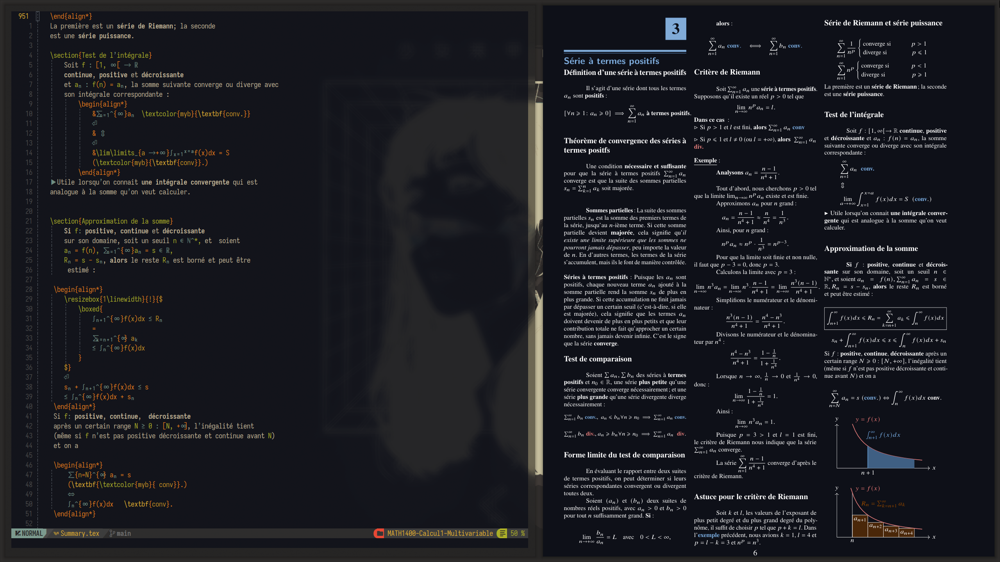
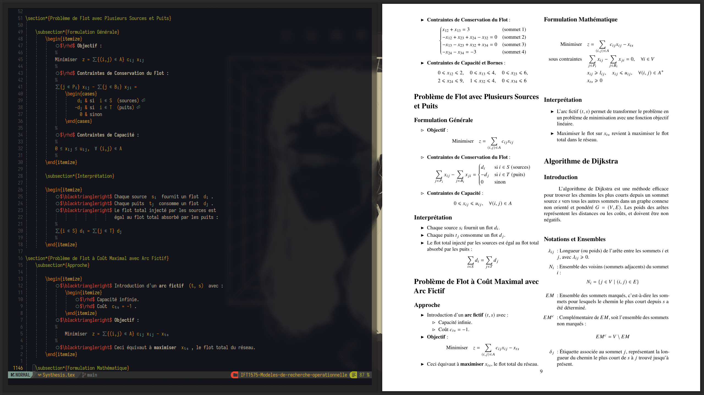
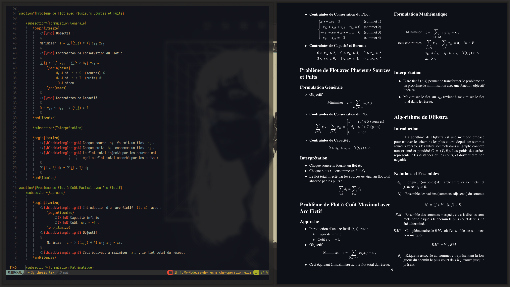

# University Lecture Notes - LaTeX Source Code

This repository contains all the LaTeX source code for the lecture notes I took during my time at university. The aim is to provide a comprehensive template that you can use for your own notes or documents, especially if you're new to LaTeX.

## Overview

The core of this template is built around the `preamble.tex` file located in the `LaTeXTemplate` folder. This folder also includes other essential files used to compile the documents:

1. [`letterfonts.tex`](LaTeXTemplate/letterfonts.tex)
2. [`macros.tex`](LaTeXTemplate/macros.tex)
3. [`lstlistingEnvs.tex`](LaTeXTemplate/lstlistingEnvs.tex)

These files contain shortcuts for mathematical symbols, custom macros, and LaTeX environments that help present information in organized boxes.

A lot of this template has been influenced by other people such as [**Senior Mars**](https://github.com/SeniorMars/dotfiles) and [**Gilles Castel**](https://castel.dev/post/lecture-notes-1/) († 2022).



## Preview of the Notes

### Multivariable Calculus




### Operational Research




## How to Use the Template

If you're new to LaTeX, this step-by-step guide will help you get started using this template for your own documents.

### Prerequisites

- **LaTeX Distribution**: Install a LaTeX distribution on your computer.
  - **Windows**: [MiKTeX](https://miktex.org/download)
  - **macOS**: [MacTeX](http://www.tug.org/mactex/)
  - **Linux**: Install TeX Live via your package manager (e.g., `sudo apt-get install texlive-full` on Ubuntu).
- **Text Editor**: Use any text editor or a LaTeX-specific editor.
  - Examples: [TeXstudio](https://www.texstudio.org/), [TeXworks](https://www.tug.org/texworks/), [Overleaf](https://www.overleaf.com/) (online editor)

### Step-by-Step Guide

1. **Download or Clone the Repository**

   - **Clone via Git**:
     ```bash
     git clone https://github.com/yourusername/yourrepository.git
     ```
   - **Download ZIP**:
     - Click on the green "Code" button at the top right of the repository page.
     - Select "Download ZIP" and extract it to your desired location.

2. **Set Up Your Project Directory**

   - Create a new folder for your LaTeX project.
   - Copy the `LaTeXTemplate` folder from the repository into your project directory.

3. **Create Your Main LaTeX Document**

   - In your project directory, create a new file named `main.tex`.
   - This will be the main file where you write your content.

4. **Structure Your `main.tex` File**

   - Open `main.tex` in your text editor.
   - Include the template files using the `\input{}` command.
   - Your `main.tex` should look like this:

     ```latex
     % main.tex
     \input{LaTeXTemplate/preamble.tex}

     \begin{document}

     % Your content goes here

     \end{document}
     ```

5. **Customize Your Document**

   - Add a title, author, and date to your document:
     ```latex
     \title{My Lecture Notes}
     \author{Your Name}
     \date{\today}
     ```
   - Include these before `\begin{document}`.

6. **Start Writing Content**

   - Begin your document with `\maketitle` and `\tableofcontents` if desired:
     ```latex
     \begin{document}

     \maketitle
     \tableofcontents

     % Your content starts here

     \end{document}
     ```
   - Write your notes between `\begin{document}` and `\end{document}`.

7. **Use Custom Commands and Environments**

   - Take advantage of the predefined macros and environments from the template.
   - Examples:
     - **Math Shortcut**:
       ```latex
       Let $f(x) = x^2$. Then the derivative is $f'(x) = 2x$.
       ```
     - **Definition Environment**:
       ```latex
       \begin{definition}
       A \emph{metric space} is a set $M$ together with a function $d: M \times M \to \mathbb{R}$ satisfying certain properties.
       \end{definition}
       ```
     - **Theorem and Proof Environment**:
       ```latex
       \begin{theorem}
       If $f$ is continuous on $[a, b]$, then $f$ is integrable on $[a, b]$.
       \end{theorem}

       \begin{proof}
       The proof follows from the definition of continuity and the properties of the Riemann integral.
       \end{proof}
       ```

8. **Compile Your Document**

   - Open a terminal or command prompt.
   - Navigate to your project directory.
   - Run the LaTeX compiler:
     ```bash
     pdflatex main.tex
     ```
   - This will generate a `main.pdf` file in your project directory.

### Sample Boilerplate `main.tex`

Here's an example of what your `main.tex` file might look like:

```latex
% main.tex
\input{LaTeXTemplate/preamble.tex}

\title{My Lecture Notes}
\author{Your Name}
\date{\today}

\begin{document}

\maketitle
\tableofcontents

\section{Introduction}

Welcome to my lecture notes. This document covers various topics discussed in class.

\section{Mathematical Concepts}

Let $f(x) = x^2$. Then the derivative is $f'(x) = 2x$.

\begin{definition}
A \emph{vector space} over a field $\mathbb{F}$ is a set $V$ together with two operations that satisfy eight axioms.
\end{definition}

\begin{theorem}
Every finite-dimensional vector space has a basis.
\end{theorem}

\begin{proof}
The proof involves constructing a basis by extending a linearly independent set.
\end{proof}

\end{document}
 

